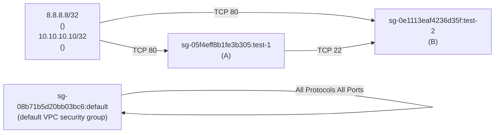

```mermaid
flowchart LR
	sg-05f4eff8b1fe3b305["sg-05f4eff8b1fe3b305:test-1
(A)"]
	8.8.8.8/32["8.8.8.8/32
()
10.10.10.10/32
()"]
	sg-0e1113eaf4236d35f["sg-0e1113eaf4236d35f:test-2
(B)"]
	sg-08b71b5d20bb03bc6["sg-08b71b5d20bb03bc6:default
(default VPC security group)"]
	8.8.8.8/32-->|"TCP 80"|sg-05f4eff8b1fe3b305
	8.8.8.8/32-->|"TCP 80"|sg-0e1113eaf4236d35f
	sg-05f4eff8b1fe3b305-->|"TCP 22"|sg-0e1113eaf4236d35f
	sg-08b71b5d20bb03bc6-->|"All Protocols All Ports"|sg-08b71b5d20bb03bc6
```