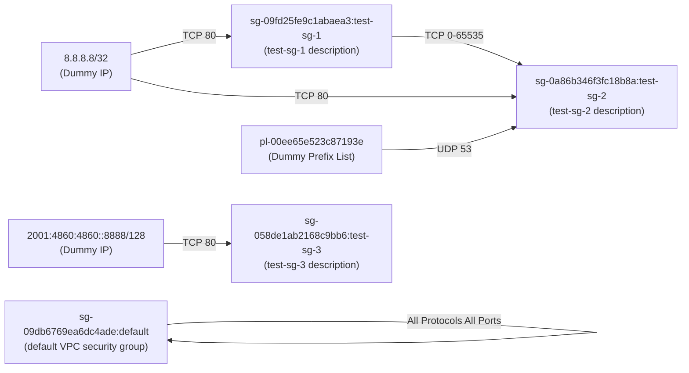

```mermaid
flowchart LR
	sg-09fd25fe9c1abaea3["sg-09fd25fe9c1abaea3:test-sg-1
(test-sg-1 description)"]
	8.8.8.8/32["8.8.8.8/32
(Dummy IP)"]
	sg-058de1ab2168c9bb6["sg-058de1ab2168c9bb6:test-sg-3
(test-sg-3 description)"]
	2001:4860:4860::8888/128["2001:4860:4860::8888/128
(Dummy IP)"]
	sg-0a86b346f3fc18b8a["sg-0a86b346f3fc18b8a:test-sg-2
(test-sg-2 description)"]
	pl-00ee65e523c87193e["pl-00ee65e523c87193e
(Dummy Prefix List)"]
	sg-09db6769ea6dc4ade["sg-09db6769ea6dc4ade:default
(default VPC security group)"]
	8.8.8.8/32-->|"TCP 80"|sg-09fd25fe9c1abaea3
	2001:4860:4860::8888/128-->|"TCP 80"|sg-058de1ab2168c9bb6
	8.8.8.8/32-->|"TCP 80"|sg-0a86b346f3fc18b8a
	sg-09fd25fe9c1abaea3-->|"TCP 0-65535"|sg-0a86b346f3fc18b8a
	pl-00ee65e523c87193e-->|"UDP 53"|sg-0a86b346f3fc18b8a
	sg-09db6769ea6dc4ade-->|"All Protocols All Ports"|sg-09db6769ea6dc4ade
```